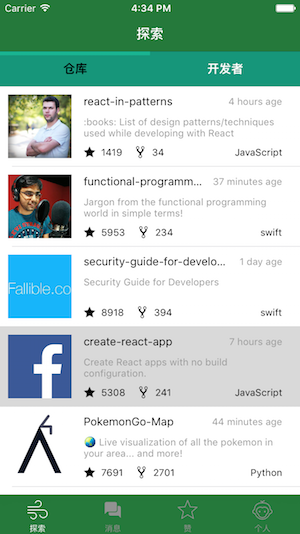
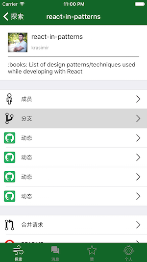
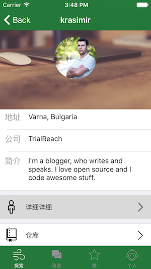
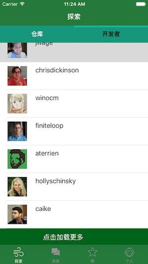

# YZGithub 
> Github客户端

#### 关键字
* SWITF 2.2
* MOYA
* GITHUB
* NETWORK
* URLRouter

#### 使用说明
1. Download
2. pod install
3. open xcworkspace

#### BUG (欢迎大家提PR)
1. 前期强制解包的一系列问题
2. 前期代码逻辑的系列问题

#### 效果图
 -  - 

---
 -  - 

---

# 功能
* [x] 授权登陆
* [x] 趋势界面(仓库,开发者)
* [x] 网络公用库
* [x] 仓库详情页面(分支,PR,开发者)
* [x] 开发者详情页面(仓库列表)
* [x] 个人界面
* [x] 分享功能
* [x] 消息界面
* [x] 动态界面
* [ ] 分支详情
* [ ] 各个cell优化
* [ ] 趋势页面(区分日,周,月)
* [ ] 个人页面效果优化
* [ ] 仓库动态页面

# 联系我们

> 1. Github地址 [链接](https://github.com/YZMobileTalks)
> 2. Blog 地址 [链接](http://www.52learn.wang/)
> 3. 微信公众号 : YZMobileTalks

<h4>扫描下面二维码获取最新文章</h4>

